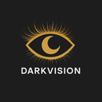
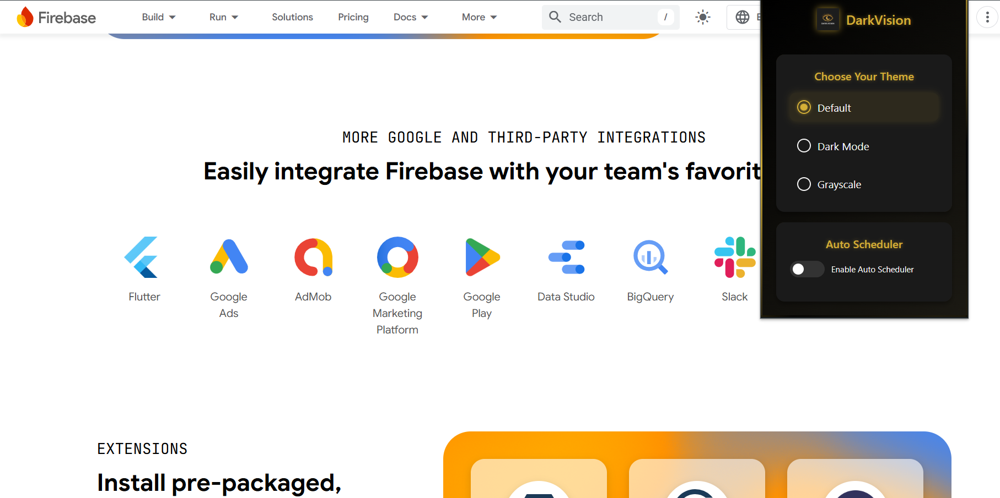
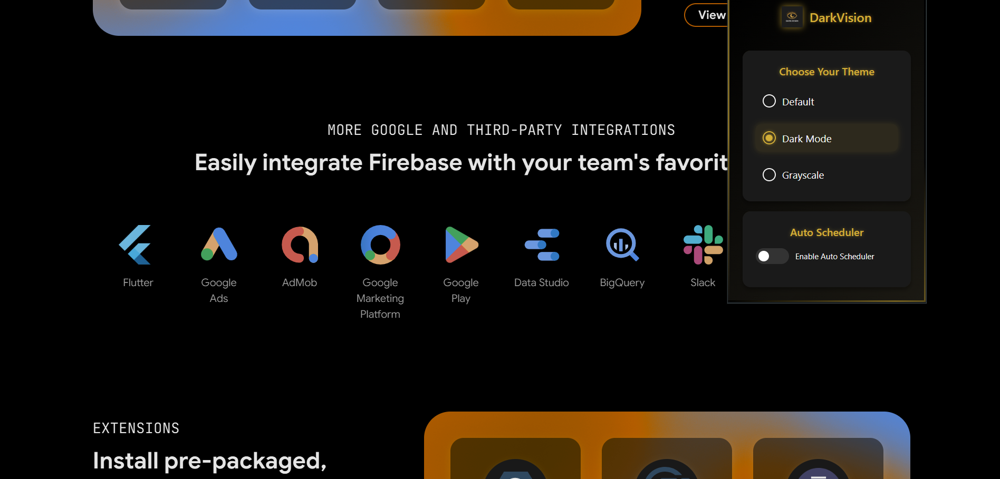
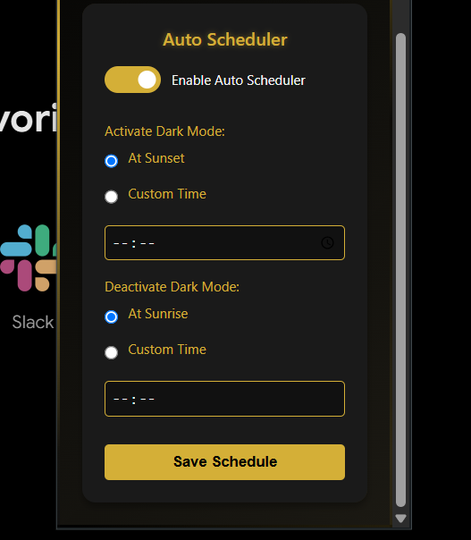

# DarkVision Chrome Extension

## Introduction

DarkVision is an open-source Chrome extension designed to enable Dark Mode across all websites, reducing eye strain and enhancing the browsing experience in low-light environments.

This extension applies dark mode and various filters to websites that do not natively support it.

**[View Demo](https://example.com/demo)**

## Features

- Supports the following display modes:
  - Dark Mode
  - Grayscale Mode
- Remembers your preference for each website.
- Lightweight and easy to use.
- Auto Scheduler function: Set NightShift to automatically activate at sunset or your preferred time for seamless transitions.

## Screenshots

1. **Default Mode**
   

2. **Dark Mode**
   

3. **Auto Scheduling**
   

## How to Use

Download the zip file from this GitHub repository, then:

1. Open Chrome and enable Developer Mode in the Extensions page (chrome://extensions/).
2. Click Load Unpacked.
3. Select the folder containing the manifest.json file.
4. Pin the extension to the Chrome toolbar to see the results.

## Permissions

- **activeTab**: Allows the extension to modify the appearance of the current tab.
- **storage**: Saves user preferences for each website.
- **host permissions**: Grants access to websites to apply dark mode filters.

## Contributing

DarkVision is an open-source project. If you have ideas for improvements or bug fixes, feel free to submit a pull request (PR). Let's make DarkVision even better together!

## Compatibility

DarkVision is compatible with any website that supports JavaScript.

## Disclaimer

DarkVision is an independent project and is not affiliated with any company or website.

## License

This project is licensed under the [MIT License](LICENSE).

## Contact

For questions, suggestions, or feedback, feel free to reach out via GitHub's issue tracker or email at **malathi3925@gmail.com**.

Thank you for using DarkVision!